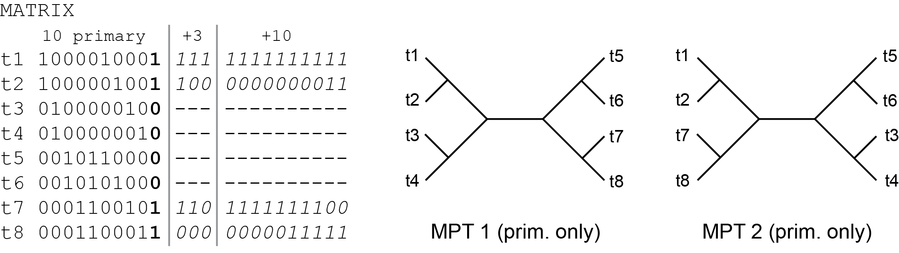

# HSJ: Synthetic dataset #

We created two synthetic datasets with only one controlling primary character but different numbers of secondary characters relative to the total number of primary characters. The matrices have ten primary characters, where the distribution of variation in the first ten characters is structured so that there are two unrooted most parsimonious trees (MPTs) under the Fitch approach ([Chai & Housworth 2011](https://doi.org/10.1007/s11538-010-9579-3), [Radel et al 2013](https://doi.org/10.1016/j.ympev.2013.08.001)). The tenth primary is the controlling primary character, is described by either three or ten secondary characters, and is present in half of the taxa but absent in the other half, in a way that is inconsistent with the other characters.

+ The dataset with 8 taxa and 13 characters consists of the character matrix:  [balanced8-13.nex](balanced8-13.nex) and the character type file:  [typBal8-13.txt](typBal8-13.txt).  

+ The dataset with 8 taxa and 20 characters consists of the character matrix:  [balanced8-20.nex](balanced8-20.nex) and the character type file:  [typBal8-20.txt](typBal8-20.txt).
