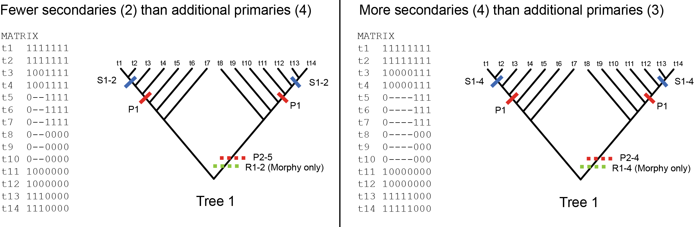

# HSJ:  Examples #

## Overview ##

The inclusion of secondary characters (those that only are applicable to some of the taxa understudy) into phylogenetic studies can provide deeper insight into the relationship between taxa.  Below, we demonstrate one possible way to include inapplicable characters into the scoring of phylogenetic trees.  To do so, we use two key ideas:

+ The scoring extends the canonical algorithm of [Fitch, 1971](https://doi.org/10.1093/sysbio/20.4.406) that computes the sum of the changes across the branches of the tree, and
+ To include inapplicable characters in the sum of the changes, we use a disparity measure that weights the primary and secondary contribution to the change.  For this proof-of-concept, we use the HSJ disparity measure of [Hopkins & St. John, 2018.](https://doi.org/10.1098/rspb.2018.1784), but others can be used instead.  The HSJ measure has a scaling parameter, &alpha;, that adjusts the weight inapplicable characters have in the analysis.  

We build on the extendible frameworks of [Brazeau, Guillerme, and Smith, 2019.](https://doi.org/10.1093/sysbio/syy083) to implement the algorithm.

## Red/Blue Traits ##

[Maddison, 1993](https://doi.org/10.1093/sysbio/42.4.576) considered the situation where some taxa have tails, some do not, and how do you include that information in the analysis.  We start with a simple example of antennae and then discuss the Maddison example.

&nbsp;

### Antennae Example ###

&nbsp;

Silhouettes modified from [phylopic.org](phylopic.org) (Scutigerella immaculata by  Janssen, Prpic, Damen, & Keesey; Lithobius forficatus by B. Lang).

We start with a simpler example (pictured above).  The  matrix  has four taxa: two (t1 and t2) with red antennae and two (t3 and t4) with blue antennae.  Taxa t1 and t4 represent Symphyla myriapods, and t2 and t3 represent Chilopoda myriapods. The first character in the matrix indicates the presence or absence of antennae.  The next four characters, in gray italics, describe the antennae.  If antennae are not present (i.e., the first character is coded as absent or '0'), then these characters are inapplicable in the analysis.  For this example, antennae are coded as present for all the taxa.

The two trees are annotated with the transitions for character states required for an internal labeling with minimal number of changes.  Focusing first on the four primary characters, scoring the trees via the canonical algorithm of [Fitch, 1971](https://doi.org/10.1093/sysbio/20.4.406), the left-hand tree has a score of 6, and the right-hand tree has a score of 3.  The right-hand tree has the better score, and, in fact, the best score over all possible trees on these taxa.

The secondary characters have an additional 4 (and 8, resp.) changes for the left-hand (right-hand) tree, which if included directly in the scores, favors the left-hand tree.  In this case, the contribution of the secondary characters outweighs the primary character contribution and yields a different tree as optimal.

To include secondary characters in the analysis, we scale the contribution of each associated primary by their secondary character contribution, scaled by a parameter, &alpha;, ranging from 0 to 1.  We use the HSJ disparity measure in the examples below, but other disparity measures can be used as well.  For the HSJ measure, when &alpha;=0, there is no contribution of the secondaries, and the scores are identical to the Fitch algorithm on the primary characters.  When
&alpha;=0.5, the contribution is 50% of the fraction of the secondaries that disagree.   So, the left-hand tree has a score of 6 + &alpha;*(4/4) = 6 + 0.5*1 = 6.5.  The right hand tree has a score of 3 + &alpha;*(4/4+4/4) = 4.  If &alpha;=1.0, then the scores become 7 and 5.

&nbsp;

### Maddison's Red/Blue Tail Example ###
&nbsp;

&nbsp;

[Maddison, 1993](https://doi.org/10.1093/sysbio/42.4.576) examined inapplicable characters, describing a hypothetical situation where the first character is the presence or absence of a tail and includes additional characters that describe the tail, if present.  

+ Work through the example of Maddison.

+ Walk through scoring a tree in R.
