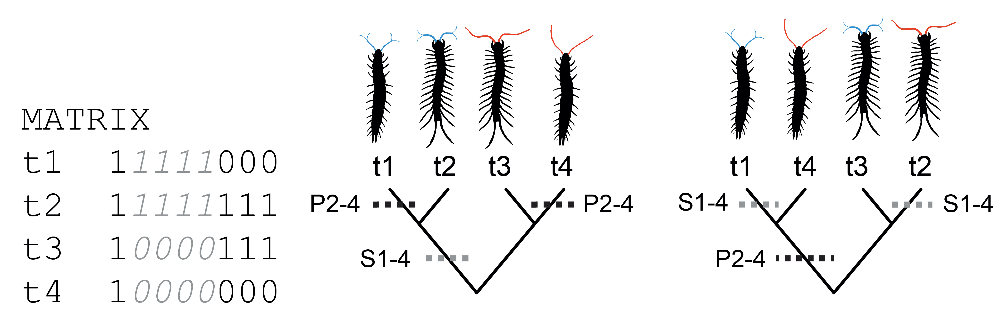

# HSJ:  Examples #

## Overview ##

The inclusion of secondary characters (those that only are applicable to some of the taxa understudy) into phylogenetic studies can provide deeper insight into the relationship between taxa.  Below, we demonstrate one possible way to include inapplicable characters into the scoring of phylogenetic trees.  To do so, we use two key ideas:

+ The scoring extends the canonical algorithm of [Fitch, 1971](https://doi.org/10.1093/sysbio/20.4.406) that computes the sum of the changes across the branches of the tree, and
+ To include inapplicable characters in the sum of the changes, we use a disparity measure that weights the primary and secondary contribution to the change.  For this proof-of-concept, we use the HSJ disparity measure of [Hopkins & St. John, 2018.](https://doi.org/10.1098/rspb.2018.1784), but others can be used instead.  The HSJ measure has a scaling parameter, $$\alpha$$, that adjusts the weight inapplicable characters have in the analysis.  

We build on the extendible frameworks of [Brazeau, M. D., T. Guillerme, and M. R. Smith. 2019.](https://doi.org/10.1093/sysbio/syy083) to implement the algorithm.

## Red/Blue Traits ##

[Maddison, 1993](https://doi.org/10.1093/sysbio/42.4.576) considered the situation where some taxa have tails, some do not, and how do you include that information in the analysis.  We start with a simple example of antennae and then discuss the Maddison example.

### Antennae Example ###

We start with a simpler example (pictured above), where we have four taxa, two with red antennae and two with blue antennae.  The matrix has eight characters with the first character indicating the presence or absence of antennae.  The next four characters, shaded in light gray, describe the antennae.  If antennae are not present (the first character is coded as absent or '0'), then these characters are inapplicable in the analysis.  For this example, antennae are coded as present for all the taxa.

Expand to explain different ways to handle secondary characters-- ignore, weight as primaries, use a disparity measure.

### Maddison's Red/Blue Tail Example ###

Describe red-tail/blue-tail examples. (maybe include images from SOM?).  Include data files and scripts in this directory.

Work through the example of Maddison.

Walk through scoring a tree in R.
